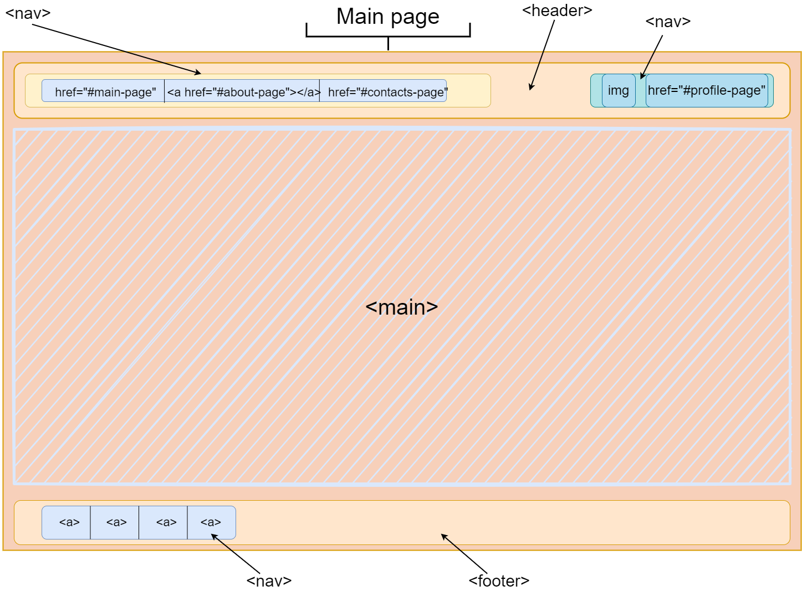
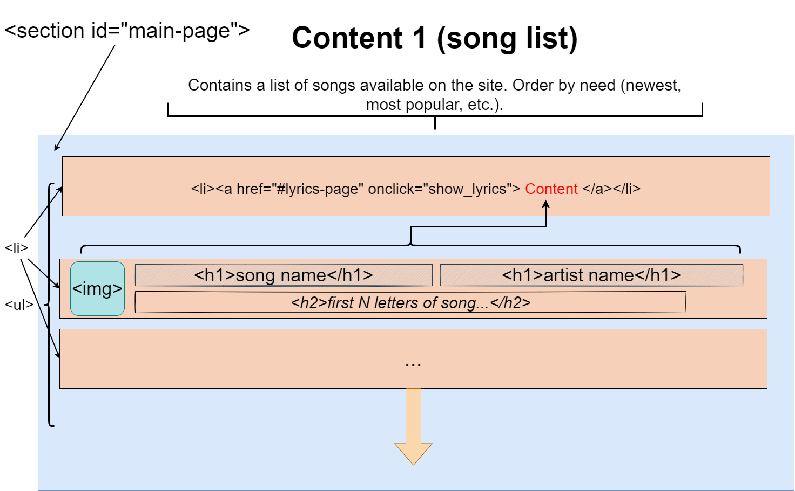
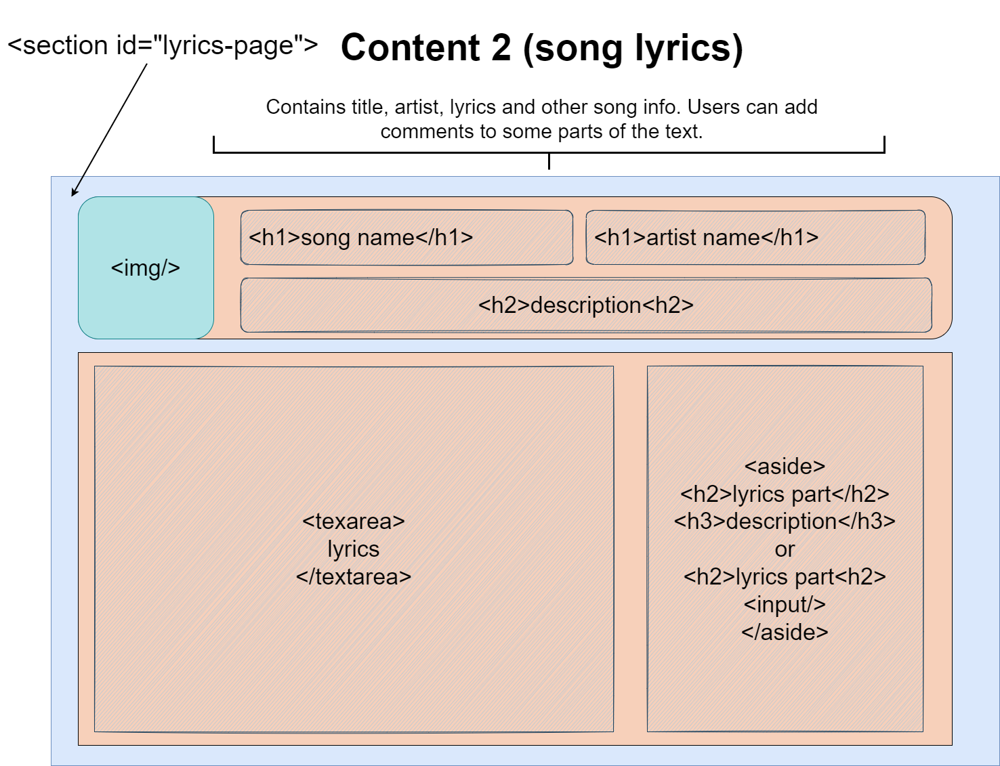
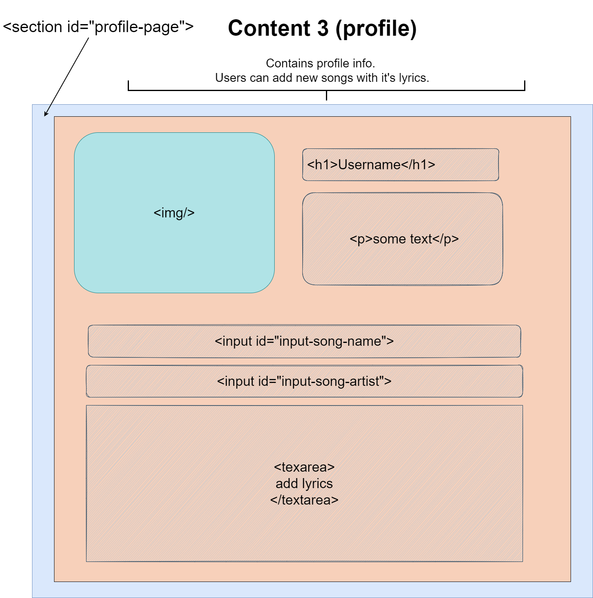
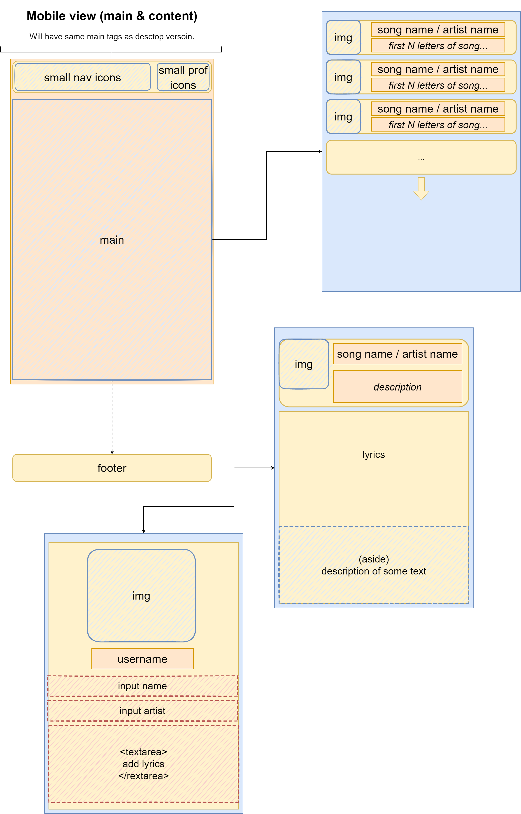

## Dubrovskiy Konstantin 953502

### Song and lyrics DB
___

An application to store and discuss song lyrics.
Deployed on https://rocky-coast-08048.herokuapp.com/

__Basic functions:__
* Music tracks (CRUD)
  + title
  + album
  + author
* Lyrics (CRUD)
  + author/image
  + user can add song to the DB
  + user can select (with mouse or touch) a part of the text and add an annotation to it
  + text parts with annotations should be highlighted in text, annotations are displayed near the text
* Users
  + authorization (login/register)
  + user can add songs/coments only after login

__Examples__: _[Genius](https://genius.com/)_

### UX outline
___

_Main page:_

_Song list:_

_Song lyrix:_

_Profile page:_

_Mobile view:_
